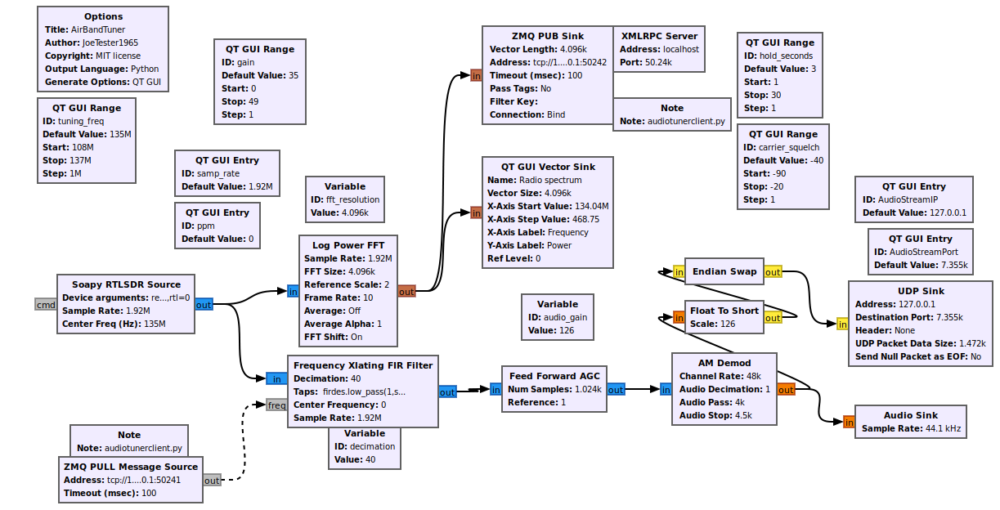

# airbandtuner

Will autoscan and tune into the most powerful AM broadcast up in the skies for a large frequency range wherever you tune your RTL dongle or other SoapySDR compatible device.

Edit the **Soapy RTLDSR Source block** -> **Device Arguments** in gnuradio_companion as needed e.g. for a local RTL SDR:

**rtl=0**

Or a [SoapyRemote](https://github.com/pothosware/SoapyRemote) device:

**remote=192.168.1.50,driver=remote,remote:timeout=100000,remote:driver=rtlsdr,rtl=0**

Audio can be heard either through the local default sound card or remotely by starting VLC player on the host corresponding with **AudioStreamIP** using **AudioPort** as defined in the [gnuradio sketch](./design.png).

e.g. as in the defaults, on 127.0.0.0.1 type:

```vlc -I dummy --demux=rawaud --rawaud-channels=1 --rawaud-samplerate=48000 udp://@:7355```


# Using

Edit the **Soapy RTLDSR Source block** to meet your needs as outlined above.

Then:

```console
bash ./start.sh 
2024-05-01 11:48:52,306 [INFO] Waiting to connect to gnuradio sketch ...
2024-05-01 11:48:52,349 [INFO] Connected gnuradio sketch
2024-05-01 11:48:55,720 [INFO] Tuned to am channel 134.90
2024-05-01 11:49:01,731 [INFO] Tuned to am channel 135.00

bash ./end.sh
```

# Dependancies

Tested on Ubuntu 22.04.4 (GnuRadio 3.10). Should also work on 3.9 but not below that.

```console
sudo add-apt-repository ppa:gnuradio/gnuradio-releases
sudo apt-get update
sudo apt-get install gnuradio
sudo apt-get install soapysdr-module-all, rtl_sdr
```

For SoapyRemote
```console
sudo apt-get install soapyremote-server
```

AFor remote audio client
```
sudo apt-get install vlc
```

# User interface


| Item | Description |
| :-: | :-:|
| tuning_freq | Coarse tuning into the frequencies of interest, in 1MHz jumps. For example selecting 135000000 (135MHz) will let you listen in on activity within 134 MHz and 136 MHz. |
| gain | Tune this using the Power/Frequency graph in the user interface so that you see decent audio signals (the large upward spikes) appear on the graph above the noise floor. |   
| carrier_squelch | Set this to the lowest power level (as in the displayed graph) of signals you want to listen to, bigger values have a better signal to noise ratio and sound clearer. |
| hold_seconds | Do not tune into another concurrent (albeit higher signal to noise) audio channel for this interval (prevents rapid flipping between channels). |  
| AudioStreamIP | IP to push raw remote audio |
| AudioStreamPort| Port to push raw remote audio  |
| samp_rate | SDR sample rate |
| ppm | SDR frequency error value |

# Design



You can still run the flow graph [airbandtuner.grc](https://github.com/JoeTester1965/airbandtuner/blob/main/airbandtuner.grc) in gnuradio-companion without running [airbandtunerclient.py](https://github.com/JoeTester1965/airbandtuner/blob/main/airbandtunerclient.py) as well, it just will not auto tune into the audio. 

I decided to delegate processing of the FFT for channel selection over the network to a custom python program as unfortunately the built in GNURadio Max() block is no use as you need the index from the FFT for tuning as well as the power value. 

There are upsides to this though ...

# Future possibilities

* CSV file of useful stats e.g. frequency, timestamp, power, talk-duration (for all concurrent channels).
* Radio frequency name identification based on your location and harvested frequency name guide databases.
* Speech to text, then hooks to flights on [ADSB exchange](https://globe.adsbexchange.com)!

## Contributing

Please do email JoeTester1965 at mail dot com with any questions.

## License

[MIT](https://choosealicense.com/licenses/mit/)
