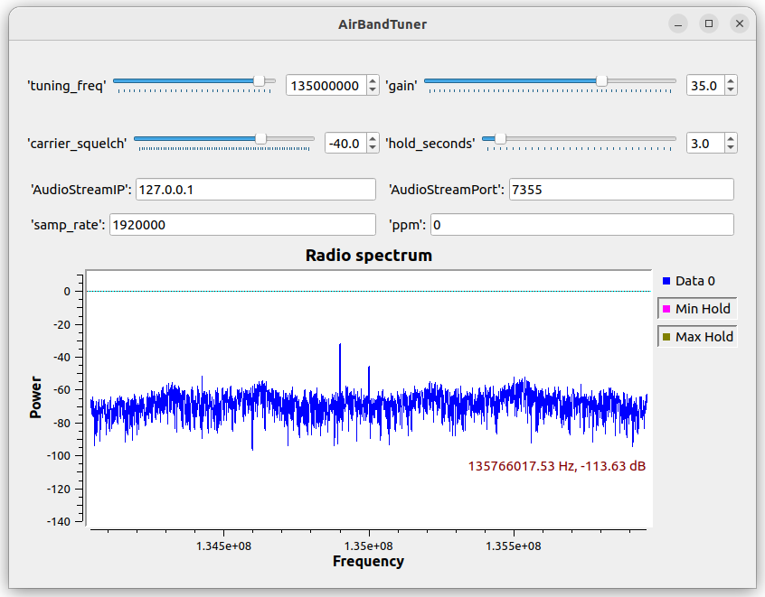

# airbandtuner

Will autoscan and tune into the most powerful AM broadcast up in the skies for a large frequency range wherever you tune your RTL dongle.

# Using

```console
./start.sh 
2022-08-04 08:39:23,045 [INFO] Tuned to am channel 135.43
2022-08-04 08:39:43,311 [INFO] Tuned to am channel 135.50
2022-08-04 08:39:56,755 [INFO] Tuned to am channel 135.43
2022-08-04 08:40:01,344 [INFO] Tuned to am channel 135.51
2022-08-04 08:40:09,061 [INFO] Tuned to am channel 135.50
2022-08-04 08:40:18,608 [INFO] Tuned to am channel 134.98
CTRL-C
```

# Dependancies

* [GNURadio](https://wiki.gnuradio.org/index.php/InstallingGR) Note: have only tested on 3.10.

* [rtl-sdr](https://www.rtl-sdr.com/rtl-sdr-quick-start-guide/) Note: On Linux just do sudo apt-get install rtl-sdr.

* A default audio out device compatible with GnuRadio.

# User interface



| Item | Description |
| :-: | :-:|
| tuning_freq_ | Coarse tuning into the frequencies of interest, in 1MHz jumps. For example selecting 135000000 (135MHz) will let you listen in on activity within 134 MHz and 136 MHz. |
| gain | Tune this using the Power/Frequency graph in the user interface so that you see a decent audio signals appear above a controlled noise floor. |   
| rtl_device_arguments | Set blank if only using one USB dongle, otherwise use **rtl=1** for a second dongle etc. For a networked dongle with [rtl_tcp](https://manpages.ubuntu.com/manpages/trusty/man1/rtl_tcp.1.html) (which is installed as part of the rtlsdr package) use something like **rtl_tcp=192.168.1.57:1234**.  |
| rtl_ppm_ | The clock error of your dongle, see [this](https://www.rtl-sdr.com/tag/ppm/) as one way of working out what that is. |  
| carrier_squelch | Set this to the lowest power level (as in the displayed graph) of signals you want to listen to, bigger values have a better signal to noise ratio and sound clearer. |
| audio_squelch | Lower this a bit if you never hear anything. Raise this a bit if you still hear noise after a transmissions has finished. |
| hold_seconds | Do not tune into another concurrent (albeit higher signal to noise) audio channel for this interval (prevents rapid flipping between channels). |  

# Design


You can still run the flow graph [airbandtuner.grc](https://github.com/JoeTester1965/airbandtuner/blob/main/airbandtuner.grc) in gnuradio-companion without running [airbandtunerclient.py](https://github.com/JoeTester1965/airbandtuner/blob/main/airbandtunerclient.py) as well, it just will not auto tune into the audio. 

I decided to delegate processing of the FFT for channel selection over the network to a custom python program as unfortunately the built in GNURadio Max() block is no use as you need the index from the FFT for tuning as well as the power value. 

There are upsides to this though ...

# Future possibilities

* CSV file of useful stats e.g. frequency, timestamp, power, talk-duration (for all concurrent channels).
* Radio frequency name identification based on your location and harvested frequency name guide databases.
* Speech to text, then hooks to flights on [ADSB exchange](https://globe.adsbexchange.com)!

## Contributing

Please do email JoeTester1965 at mail dot com with any questions.

## License

[MIT](https://choosealicense.com/licenses/mit/)